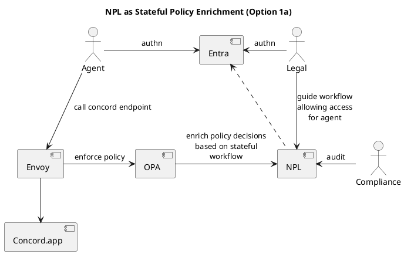
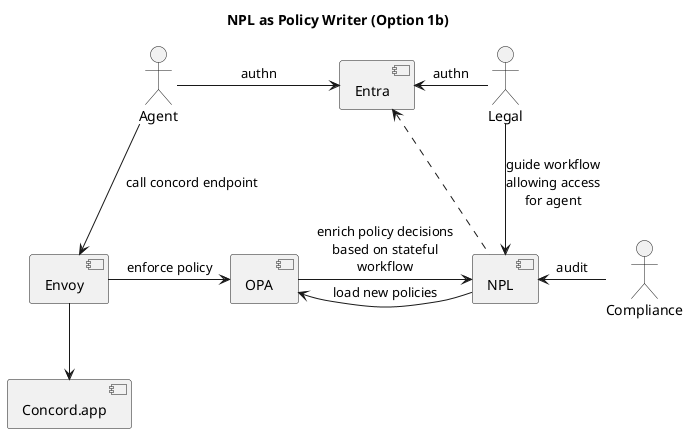
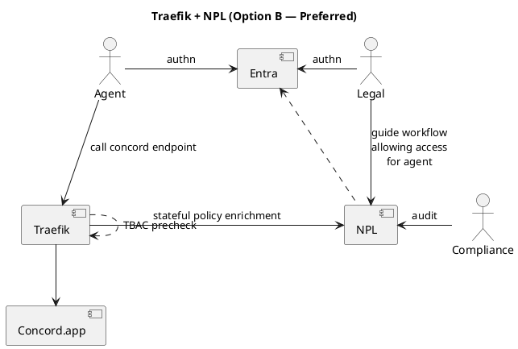
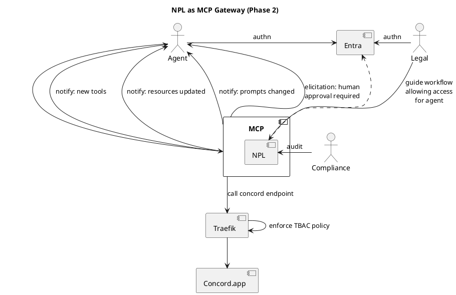
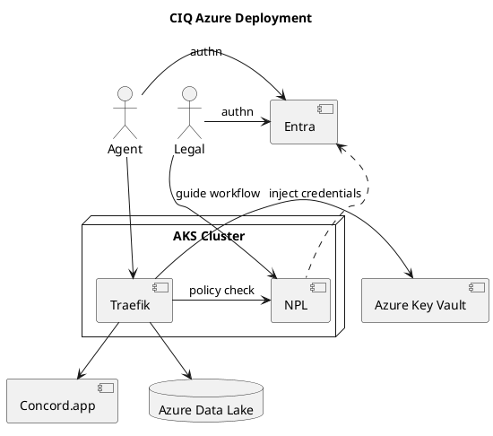

# Noumena Stateful Governance Layer for ChainIQ — Technical Scope

## Overview

Noumena deploys NPL (Noumena Protocol Language) as a stateful governance layer in front of ChainIQ's systems. The solution is delivered in two phases: Phase 1 establishes governance over agent-to-system interactions using industry-standard proxy infrastructure. Phase 2 introduces full MCP (Model Context Protocol) support, unlocking real-time governance capabilities unique to NPL.

---

## Phase 1: Stateful Governance via Proxy (4 weeks)

Phase 1 delivers governed agent access to Concord.app using a request-response architecture. Agents authenticate via Microsoft Entra ID. Every request passes through a policy layer before reaching Concord. NPL provides stateful governance, RBAC enforcement, and a full audit trail.

No MCP protocol is required in this phase — agents interact via standard REST through the proxy.

### Implementation Option A: Envoy + OPA + NPL

Three components, clear separation of concerns:

- **Envoy** handles transport, TLS termination, load balancing, and Entra JWT validation
- **OPA** provides fast stateless RBAC as a precheck (<1ms). Unauthorized requests are rejected before reaching NPL
- **NPL** provides stateful governance: workflow-aware decisions, multi-step approval chains, and audit trail

This option requires configuring the OPA-Envoy external authorization plugin and integrating NPL as a backend service that OPA consults.

#### Sub-option 1a — OPA queries NPL at request time (runtime enrichment)

OPA forwards the request context to NPL, which evaluates it against the current workflow state and returns an enriched policy decision. OPA incorporates this into its final allow/deny.

| Advantage | Tradeoff |
|---|---|
| Always consistent — decisions reflect real-time workflow state | Every authorized request incurs the NPL round-trip (tens of ms) |
| Single source of truth — no sync lag | NPL must be highly available — if NPL is down, OPA cannot decide |
| Simpler integration — OPA calls NPL as external data source | Adds latency to every request that passes RBAC |

#### Sub-option 1b — NPL pushes policies to OPA (async policy writer)

When workflow state changes in NPL (e.g., legal staff approves agent access to a new operation), NPL generates an updated Rego policy and pushes it to OPA via the OPA bundle API. OPA evaluates requests independently using pre-loaded policies.

| Advantage | Tradeoff |
|---|---|
| Zero added latency at request time — OPA decides alone | Eventually consistent — small delay between NPL state change and OPA policy update |
| NPL downtime does not block requests — OPA has last-known-good policies | Requires NPL-to-Rego policy generation (additional build effort) |
| Clean separation — NPL governs, OPA enforces | Two representations of the same policy (NPL state + Rego) must stay in sync |

**Recommendation:** For Phase 1 with human-triggered workflows, the delay in 1b (seconds) is acceptable. Legal staff approve an action, NPL pushes the policy, and by the time the agent acts, OPA has the updated rules. Option 1b is operationally simpler and keeps the request path fast. Option 1a is the better choice if real-time consistency is a hard requirement.

### Implementation Option B: Traefik + NPL (Preferred)

Two components instead of three. Traefik Hub's MCP middleware includes Task-Based Access Control (TBAC), a built-in policy engine that replaces OPA:

- **Traefik** handles transport, Entra JWT validation, **and** stateless policy via TBAC expressions (task, tool, and transaction-level constraints)
- **NPL** provides stateful governance on top: workflow-aware decisions, approval chains, and audit trail

TBAC acts as the fast precheck. NPL is called only for requests that pass TBAC and require stateful evaluation.

The same sub-options (1a: NPL queried at runtime, 1b: NPL pushes TBAC rules) apply, though Traefik's native expression language is simpler to target than Rego generation.

| | Option A: Envoy + OPA + NPL | Option B: Traefik + NPL |
|---|---|---|
| Components | 3 | 2 |
| Stateless policy | OPA (Rego) | TBAC (built into Traefik) |
| MCP-specific filtering | Via ext auth hooks | Native (tools, resources, prompts) |
| Integration effort | OPA-Envoy plugin + NPL integration | NPL integration only |
| Team experience | Less | More |

**Option B is preferred** due to fewer moving parts, native MCP-aware policy filtering, and existing team expertise with Traefik.

### Phase 1 Service Packages

| Service Package | Tasks / Activities | Deliverable | Workload | Target |
|---|---|---|---|---|
| **SP 1: Governance Model & Concord Adapter** | Define CIQ RBAC roles and NDA workflow in NPL. Map Concord REST API operations to governed endpoints. Validate workflow logic with CIQ stakeholders. | RBAC Protocol Model. NDA Workflow Logic (approvals, state tracking). Concord API Adapter (NDA operations). | (Insert Days) | Week 1-2 |
| **SP 2: Gateway Infrastructure & Security** | Deploy gateway proxy (Traefik preferred, Envoy alternative). Integrate Entra ID for agent and legal staff authentication. Configure Azure Key Vault for credential injection. Wire stateless policy layer (TBAC or OPA) with NPL governance from SP1. | Deployed Gateway (staging). Entra ID Auth Integration. Key Vault Credential Injection. Policy Enforcement (TBAC/OPA + NPL). Deployment Manifests (Kubernetes/Docker). | (Insert Days) | Week 2-3 |
| **SP 3: Integration Testing & Delivery** | End-to-end testing: Agent → Gateway → Policy → Concord. Audit trail validation (who triggered, which policy, outcome). Staging environment handover to CIQ. Operations documentation and runbooks. | Immutable Audit Trail. Tested End-to-End Flow. Staging Environment (deployed to CIQ Azure). Technical Documentation. | (Insert Days) | Week 4 |

**Sequencing:** SP1 is domain work — starts on day 1, requires Concord API docs and role definitions from CIQ. SP2 is infrastructure — starts in parallel but policy wiring depends on SP1 governance model. SP3 is integration and handover — depends on SP1 + SP2 completion.

### Prerequisites from CIQ

- Concord API documentation
- Role definitions (or draft MSA clause mapping for RBAC)
- Azure AKS / Container Apps access
- Entra ID tenant configuration

---

## Phase 2: Full MCP Gateway with Dynamic Governance

Phase 2 introduces full Model Context Protocol support. NPL becomes the MCP-facing gateway, enabling capabilities that neither Envoy nor Traefik can provide: real-time push notifications driven by governance state changes.

NPL sits in front of Traefik for the agent-facing MCP connection. Traefik continues to handle transport and stateless policy for backend calls.

### MCP Push Capabilities — The NPL Differentiator

Every push capability in MCP requires a stateful engine that has reasons to initiate communication — because something changed. Envoy and Traefik are stateless proxies; they can filter responses but cannot initiate notifications. NPL is the stateful engine that drives these notifications:

| MCP Notification | Trigger | What happens |
|---|---|---|
| `notifications/tools/list_changed` | Legal approves new capability in NPL | Agent instantly sees new tools it can use |
| `notifications/resources/list_changed` | New document enters NPL workflow | Agent is notified of new context available |
| `notifications/resources/updated` | NDA status changes (draft → review → approved) | Subscribed agent gets notified |
| `notifications/prompts/list_changed` | Compliance updates review template in NPL | Agent picks up new prompt |
| `elicitation/create` | NPL policy requires human approval | Approval request pushed to legal staff via agent |
| `sampling` | NPL governance needs AI reasoning | NPL requests LLM completion from agent |
| `logging` | Any governance event | Audit events streamed to agent/dashboard in real-time |

### What Phase 2 Unlocks

| Capability | Phase 1 (proxy only) | Phase 2 (MCP) |
|---|---|---|
| Agent protocol | REST | Full MCP (bidirectional) |
| Tool availability | Static, agent must poll | **Dynamic — legal approves, agent notified instantly** |
| Resource availability | Static | **Dynamic — new document enters workflow, agent notified** |
| Resource subscriptions | Not available | **Agent subscribes to NDA status, gets updates on change** |
| Prompt templates | Static | **Dynamic — compliance updates review template, agent picks it up** |
| Human-in-the-loop | External to gateway | **Built into protocol — NPL sends elicitation request to agent for human approval** |
| Audit streaming | Query after the fact | **Real-time — governance events streamed to agent/dashboard via logging** |
| Sampling | Not available | **NPL can request LLM reasoning as part of governance evaluation** |

### The Core Differentiator

None of these push capabilities exist in Envoy or Traefik today. They are request-response filters. NPL is the stateful engine that makes MCP's bidirectional protocol meaningful for governance:

- NPL workflow state changes → `tools/list_changed` (new tools available)
- NPL receives new document → `resources/list_changed` (new context available)
- NPL approval status changes → `resources/updated` (subscribed agents notified)
- NPL requires human input → `elicitation/create` (approval request pushed to legal staff)

This is the transition from governed REST proxy (Phase 1) to governed intelligent agent protocol (Phase 2).

### Phase 2 Deliverables (Indicative — to be scoped after Phase 1)

- NPL MCP Gateway with Streamable HTTP transport
- Dynamic tool, resource, and prompt notification driven by NPL state
- Elicitation integration for human-in-the-loop approval workflows
- Additional backend adapters (Databricks, Azure Data Lake, Fabric, SharePoint)
- MSA clause modelling in NPL beyond basic RBAC
- Real-time audit dashboard

---

## Deployment Architecture (Azure)

---

## Out of Scope (Both Phases)

- Autonomous agent operation (human-in-the-loop is maintained throughout)
- OPA integration in Option B (TBAC replaces OPA)
- Custom agent framework development (Sligo provides the agents)
